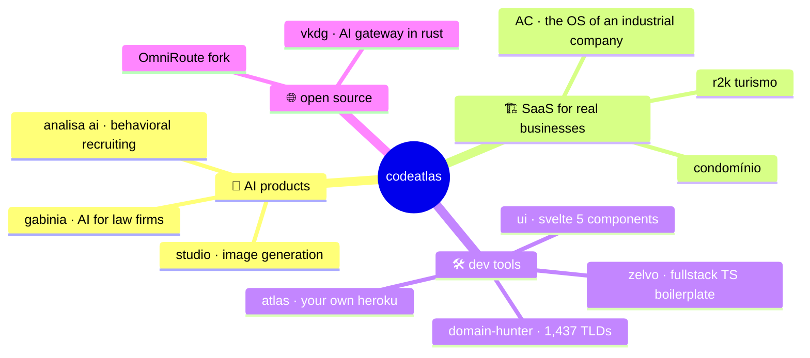

<div align="center">

<a href="https://codeatlas.com.br"></a>

<sub>📍 lat −25.43 · lon −49.27 · curitiba, brasil &nbsp;|&nbsp; cofounding <a href="https://github.com/codeatlasdev">@codeatlasdev</a> with <a href="https://github.com/mvilacad">@mvilacad</a></sub>

</div>

```
       ___  ___  ___  ___   _  _____  _      _    ___
      / __|/ _ \|   \| __| /_\|_   _|/_\    | |  / __|
     | (__| (_) | |) | _| / _ \ | | / _ \   | |__\__ \   two devs.
      \___|\___/|___/|___/_/ \_\|_|/_/ \_\  |____|___/   one atlas.
                                                         everything we ship, mapped.
```

> **this profile is a map.** codeatlas sits in the middle. every project we're building orbits around it.
> most of the territory is private (clients, products in stealth), so here's the legend instead of the code.

### 🗺️ the atlas



### 📍 territories

<details open>
<summary><b>🧠 AI that does real work</b> &nbsp;<sub>private · in production</sub></summary>
<br>

| | |
|---|---|
| **gabinia** | AI platform for law firms. reads, drafts, organizes. lawyers keep the judgment, the AI keeps the paperwork |
| **analisa ai** | intelligent recruiting with behavioral analysis. the evolution of the hiring app i started building back in 2019 |
| **studio** | our internal image generation studio (mflux + magnific). we make our own visuals |
| **wi** | WhatsApp API layer so products can talk where customers already are |

</details>

<details>
<summary><b>🏗️ SaaS for companies that aren't tech companies</b> &nbsp;<sub>private</sub></summary>
<br>

| | |
|---|---|
| **AC** | "what the ERP doesn't do, AC does." the operating system of an industrial automation company, down to the TV video walls on the factory floor. plus **ac-agentes**, AI agents running inside it |
| **condomínio** | management for residential buildings |
| **r2k turismo** | booking and lead capture for a tourism agency |
| **koatla** | something new in Go. ask me 👀 |

</details>

<details>
<summary><b>🛠️ tools we built because we needed them</b></summary>
<br>

| | |
|---|---|
| **[atlas](https://github.com/codeatlasdev/homebrew-tap)** | `brew install` our internal developer platform. deploy like it's heroku, on our own servers. written in rust |
| **[domain-hunter](https://github.com/codeatlasdev/domain-hunter)** | the fastest bulk domain checker. 1,437 TLDs, 19 registrars, price comparison. CLI + web + MCP |
| **zelvo** | fullstack typescript boilerplate. the best of both worlds, so new products start on day 2, not day 0 |
| **ui** | svelte 5 component framework. prop-driven, zero CSS opinions |

</details>

<details>
<summary><b>🌐 open source</b> &nbsp;<sub>come hang</sub></summary>
<br>

| | |
|---|---|
| **[vkdg](https://github.com/vkdprojects/vkdg)** | AI gateway in rust. plug Claude Code, Codex or any OpenAI client, it routes to the right provider, translates the protocol and streams it back |
| **[OmniRoute](https://github.com/codeatlasdev/OmniRoute)** | our fork of the OmniRoute AI gateway: sqlite fixes, headless mode, performance |
| **[portfolio](https://github.com/LuanColeto/portfolio)** | my site. a tiny robot types it in front of you, letter by letter. one go binary, zero frameworks |

</details>

### 🧭 how i got here

```diff
  2019  joined Automação Curitiba as an intern → ended up owning a recruiting mobile app
  2023  real-time urban mobility backend + a restaurant SaaS used by hundreds of places
+ 2024  cofounded codeatlas with @mvilacad
+ now   building the map above, one territory at a time
```

### ⚙️ the toolbox

<p align="center"></p>

<p align="center"></p>

<div align="center">

**want something on the map?**

[](https://codeatlas.com.br)
[](https://www.linkedin.com/in/luan-coleto/)
[](https://github.com/codeatlasdev)

</div>
