<div align="center">

<a href="https://codeatlas.com.br"></a>

<sub>📍 lat −25.43 · lon −49.27 · curitiba, brasil &nbsp;|&nbsp; cofounding <a href="https://github.com/codeatlasdev">@codeatlasdev</a> with <a href="https://github.com/mvilacad">@mvilacad</a></sub>

</div>

<p align="center"></p>

> **codeatlas is a technology consultancy from curitiba.** we don't sell a solution before we understand the problem.
> we map how a company actually runs (operations, processes, people) and only then decide what it needs:
> process, design, automation, data or software. sometimes the answer is a new system. sometimes it's deleting a spreadsheet.

### 🧭 how we work

<p align="center"> &nbsp;→&nbsp;  &nbsp;→&nbsp;  &nbsp;→&nbsp;  &nbsp;→&nbsp; </p>

<p align="center"><b>map first, build second.</b> most problems look like software problems. a lot of them aren't.</p>

<p align="center"></p>

### 👤 me, on this map

```console
$ whoami
luan coleto · cofounder @ codeatlas · curitiba, brasil

$ cat history.log
2019  started as an intern, ended up owning a recruiting mobile app
2023  real-time backends, a restaurant SaaS used by hundreds of places
2024  cofounded codeatlas with @mvilacad
now   mapping problems, shipping the fix

$ git log --author=me --since=1.year --all | wc -l
6300+   # almost all of it for clients. the map stays private, the results don't.
```

<p align="center"></p>

<p align="center"></p>

<div align="center">

**got a process that doesn't scale? let's map it.**

[](https://codeatlas.com.br)
[](mailto:contato@codeatlas.com.br)
[](https://www.linkedin.com/in/luan-coleto/)
[](https://github.com/codeatlasdev)

</div>
