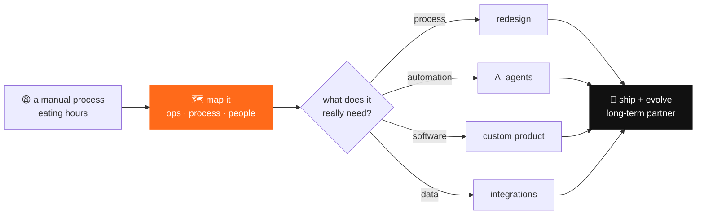

<div align="center">

<a href="https://codeatlas.com.br"></a>

<sub>📍 lat −25.43 · lon −49.27 · curitiba, brasil &nbsp;|&nbsp; cofounding <a href="https://github.com/codeatlasdev">@codeatlasdev</a> with <a href="https://github.com/mvilacad">@mvilacad</a></sub>

</div>

```
       ___  ___  ___  ___   _  _____  _      _    ___
      / __|/ _ \|   \| __| /_\|_   _|/_\    | |  / __|
     | (__| (_) | |) | _| / _ \ | | / _ \   | |__\__ \   every company has a map
      \___|\___/|___/|___/_/ \_\|_|/_/ \_\  |____|___/   nobody has drawn yet.
                                                         we draw it. then we build.
```

> **codeatlas is a technology consultancy from curitiba.** we don't sell a solution before we understand the problem.
> we map how a company actually runs (operations, processes, people) and only then decide what it needs:
> process, design, automation, data or software. sometimes the answer is a new system. sometimes it's deleting a spreadsheet.

### 🧭 how we work



### 🛠️ what we build

<table>
<tr>
<td width="50%" valign="top">

**📦 software made to measure**<br>
<sub>systems shaped around how your company works. never the other way around.</sub>

</td>
<td width="50%" valign="top">

**🤖 zelvo.ai**<br>
<sub>our AI agents for customer service. more conversations, same care.</sub>

</td>
</tr>
<tr>
<td width="50%" valign="top">

**🔄 digital transformation**<br>
<sub>processes, tools and integrations, so growth doesn't break what works.</sub>

</td>
<td width="50%" valign="top">

**🧪 agent-ready**<br>
<sub>even our site speaks MCP, A2A and llms.txt. AI can hire us too.</sub>

</td>
</tr>
</table>

### 📞 call us when

```diff
+ a critical process is manual and keeps eating time or causing errors
+ you need a system built from scratch, not another generic SaaS
+ you want AI in customer service that you can actually trust
+ the company is growing and the processes stopped scaling
+ you need a technical partner for the long run, not a one-off delivery
```

### 👤 me, on this map

```console
$ whoami
luan coleto · cofounder @ codeatlas · curitiba, brasil

$ cat history.log
2019  started as an intern, ended up owning a recruiting mobile app
2023  real-time backends, a restaurant SaaS used by hundreds of places
2024  cofounded codeatlas with @mvilacad
now   mapping problems, shipping the fix

$ git log --author=me --since=1.year --all | wc -l
6300+   # almost all of it for clients. the map stays private, the results don't.
```

<p align="center"></p>

<p align="center"></p>

<div align="center">

**got a process that doesn't scale? let's map it.**

[](https://codeatlas.com.br)
[](mailto:contato@codeatlas.com.br)
[](https://www.linkedin.com/in/luan-coleto/)
[](https://github.com/codeatlasdev)

</div>
